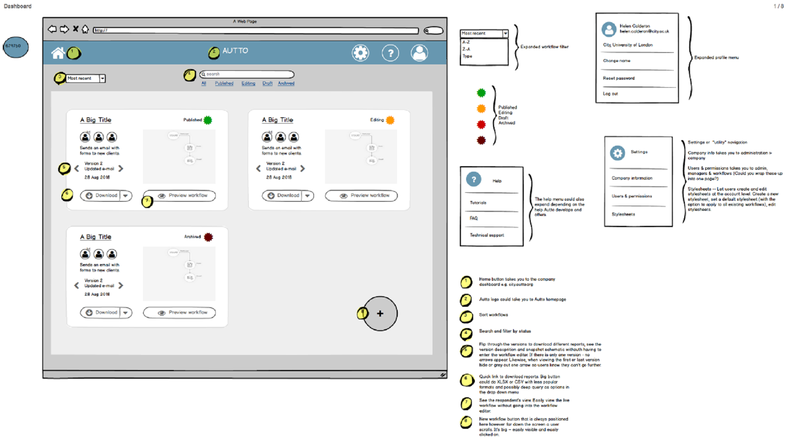

Client: Autto

 
## Overview ##

## Challenge ##
 
Autto was looking to launch its MVP. They were developing an online tool that lawyers could use to automate business processes such as agreeing and signing contracts.  The two co-founders had hired a developer, but no-one in their team had UX expertise. They knew that if their software was difficult to use, clients would not sign up and pay for a subscription.
  
## My role ##
 
I worked as UX consultant. I scoped and planned a package of 4 monthly usability tests and an expert review. My role included conducting one user testing study, and carrying on an expert review prior to tests. I sourced and briefed a student consultant to carry out the remaining 3 studies.
 
## Approach ##

### Expert review ###
 
I started the project by carrying out an expert review of the platform. This saved the client time and money, firstly because we were able to offer free expert reviews as part of work we were doing within an EU-funded programme for London-based tech start-ups. Second, the expert review drew on my UX expertise to identify problems within the application, without the time and expense of recruiting research participants. 

To carry out the expert review I met with the client, learned more about their users – lawyers – and the key tasks they'd carry out using the platform. I later carried out these tasks – creating, publishing and sharing a business process workflows – using the application as if I were a business professional.
 
Over several days, I identified 50+ issues within the application. These ranged from difficulty discovering functionality, hidden and missing system feedback, accessibility enhancements, unconventional interaction design patterns, and confusing navigation. Key findings and recommendations were prioritised for the client, and following a de-brief, I suppplimented these with low-fidelity wireframes, to better communicate my recommendations.

 

 
 ###

 
 

 
## Outcome ##
 
<!--The expert review allowed the start-up to fix obvious problems, without the time and cost of user testing. I conducted the first user testing session about a month after the expert review. This proved somewhat problematic for several reasons. First, not all the fixes had been made, so some of the same findings and recommendations came up. Secondly, we offered a package of budget user testing that did not include a pilot. Little was discovered from the first sessions as participants needed time to understand what the software did. If I were doing this testing again there are several things I’d do differently. First, get an accurate idea of the time needed to fix major defects prior to user testing. Next run a pilot, as this would have uncovered that we needed to do more to explain the product proposition. Next, possibly start by testing the educational and onboarding aspects of the software, as these could possibly be shared with users at the start of the testing. Because there was a learning curve associated with the software, if doing this again, I may suggest a diary study, as this would allow participants more time to learn the software and use it in-situ. 
 
Since working with the Interaction Lab, Autto launched its subscription software and has attracted additional investors and funding. 

-->

