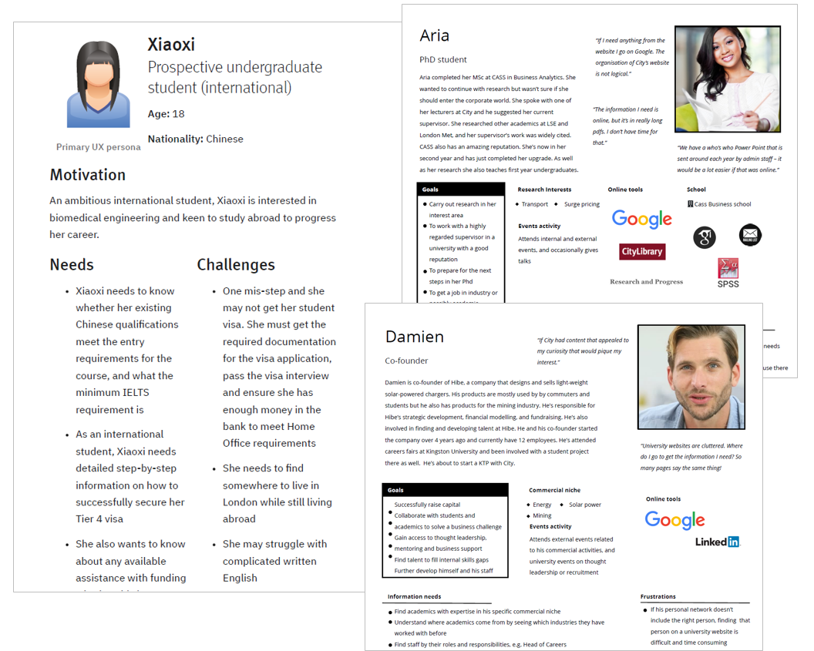
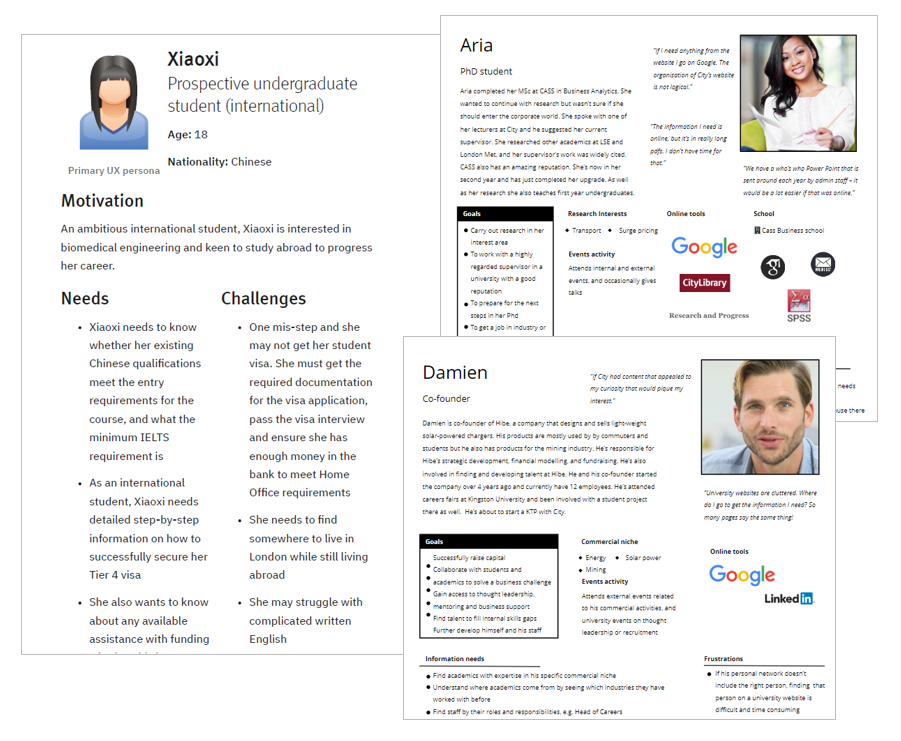

# Information architecture redesign #  

Client: City, University of London

## Challenge ## 

A public institution, with a global audience of 350,000+ users per month, City's website had last been re-developed over 10 years ago. With hundreds of CMS users and limited oversight it had grown to 20,000 pages. The site needed to answer users' questions, and help them make decisions but, with thousands of disparate pages and a lack of structure, different users couldn't find the information they sought. The website was incapable of fully supporting the university's business goals, such as attracting new students and promoting its research. 

## My role ##

I worked within an agile team as the sole information architect. I designed and conducted a programme of user research in order to provide the university with a new and proven information architecture. Throughout the process I communicated my work and proposed architecture, getting buy-in from competing internal stakeholders.

## Approach ##

### Content audit and stakeholder interviews ###

To gain an understanding of existing online content and user behaviour across City's website I began by reviewing City's existing content, website analytics and third party SEO and market research. 

I discovered:
{: .list}
* City's existing structure was quite deep impairing findability
* Thousands of pages had little content and almost no traffic, and some high-traffic pages suffered from high bounce rates
* Most website sections did not appear in the site's primary navigation, meaning users could only find them via search 
* The most popular pages were those used by students and staff, neither of whom were the site’s intended audiences.

Alongside this I also met with stakeholders to understand their content, hear their perspective on users and their tasks, and to consider what they wanted to achieve via the website.

### User research ###

#### Card sorts and interviews ####

Following the content audit and stakeholder interviews I was ready to start speaking to users. First, I conducted open card sort exercises and interviews with user groups including prospective students, researchers and lecturers and business people. 

I selected a sample of pages from across the website and asked participants to sort these into groups and label them. Participants flagged pages they didn’t understand and identified audiences and missing content. The card sorts gave me a written artefact of users' mental models of City's content &ndash; the language they used to describe City's content and how they expected City’s content to be organised. Alongside card sorts, user interviews gave me insight into their online activities and information needs. [screenshot - card sort]  [screen shot - script?]

I was restricted to 80 cards for moderated studies, so I used online studies to understand how more pages across the site might be organised. This had the added benefit of  reducing any bias that students and staff had due to their familiarity with City’s current website. 

I reviewed interview data, using sticky notes and affinity diagrams to find common goals, frustrations and information tasks and created personas to help generate empathy for users. 

<figure>

  <figcaption> I used the personas to help me imagine how different users would look for information across the site.</figcaption>
  </figure>
#### Tree testing and interviews ####

Using the labels and groupings generated from the card sorts, together with the personas, I created an initial sitemap or 'tree'. I evaluated the architecture using tree testing studies within Optimal Workshop. Most of these studies were conducted online, using participants whose profiles matched different user groups, recruited via Usertesting.com.

Alongside online tree tests, I conducted moderated sessions with academics and students. One of the problems with earlier card sorting studies was current student bias, so for these tests I recruited applicants to City and students from other universities. These moderated tests allowed me to probe users to understand how confident they felt when navigating the structure and what information they expected within different sections and pages.

I conducted tree tests iteratively, reviewing the results after each study or group of studies and updating the sitemap where the labels or structure were found to be unclear. All together I conducted 20+ tree testing studies online and 20 in-person tests.

### Communicating the new information architecture ###

I regularly communicated the information architecture to internal stakeholders through one-on-one sessions with colleagues and presentations to the project’s advisory board and executive team. During the project over 100 pieces of feedback were noted. I then explained the rationale behind the IA using existing research findings or I carried out new user studies to answer the question, or test an alternative architecture. Results were then re-communicated. This process ensured the new structure balanced stakeholder requirements with users' needs, and maintained stakeholder buy-in during the project.

### Outcome ###

After a year of user research, City has a new information architecture for its forthcoming website. This proven structure is backed by findings from over 25 studies and 900 participants. Users will be able to find the information they seek and carry out the tasks that also support university's goals. Regular consultation with internal stakeholders means there is buy-in across different departments and levels of the university.

While well evidenced, the new structure will be tested and refined further as the university tests the navigation during planned user testing at prototype stage. The refined architecture will be launched within a new site late 2020.

