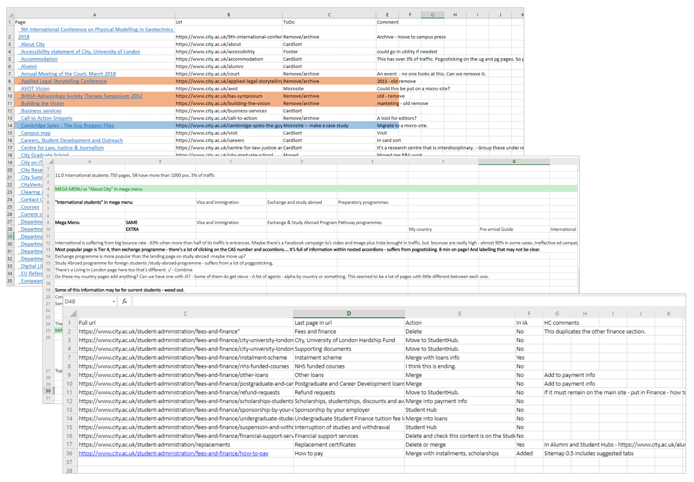

# Information architecture redesign City, Univerisity of London #

## Challenge ## 
City's website was starting to look dated. With no editorial oversight and x CMS editors, it had grown to a staggering 20,000 pages. This was hampering its ability to meet key performance goals such as increasing student recruitment and showcasing its world-leading research. 

## My role ##

I worked as information architect aspart of an agile team.

## Approach ##

### Content audit ###

To get an understanding of existing online content and user behaviour across City's website I began by reviewing City's existing content, website analytics and third party SEO and market research. 

I discovered:
{: .list}
* City's existing structure was quite deep impairing findability
* Many pages had little content and little traffic and those with traffic suffered from high bounce rates
* Most website sections did not appear in the site's primary navigation, meaning users could only find them via search 
* The most popular pages were those used by students and staff who weren’t the site’s intended audiences..

### User research ###

#### Card sorts and interviews ####

Following the content audit I was ready to start speaking to users. First, I conducted open card sort exercises and interviews with user groups including prospective students, researchers and lecturers and business people. 

I selected a sample of pages from across the website and asked participants to sort these into groups and label them. Participants flagged pages they didn’t understand and identified audiences and missing content. The card sorts gave me a written artefact of users' mental models of City's content - the language they used to describe City's content and how they expected City’s content to be organised. Alongside card sorts, user interviews gave me insight into their online activities and information needs. [screenshot - card sort]  [screen shot - script?]

I was restricted to 80 cards for moderated studies, so I used online studies to understand how more pages across the site might be organised. This had the added benefit of  reducing any bias that students and staff had due to their familiarity with City’s current website. 

I reviewed interview data, using sticky notes and affinity diagrams to find common goals, frustrations and information tasks and created personas to help generate empathy for users. [screenshot] 

#### Tree testing and interviews ####

Using the labels and groupings generated from the card sorts, together with the personas, I created an initial sitemap or 'tree'. I evaluated the architecture using tree testing studies within Optimal Workshop. Most of these studies were conducted online, using participants whose profiles matched different user groups, recruited via Usertesting.com.

Alongside online tree tests, I conducted moderated sessions with academics and students. One of the problems with earlier card sorting studies was current student bias, so for these tests I recruited applicants to City and students from other universities. These moderated tests allowed me to probe users to understand how confident they felt when navigating the structure and what information they expected within different sections and pages.

I conducted tree tests iteratively, reviewing the results after each study or group of studies and updating the sitemap where the labels or structure were found to be unclear. All together I conducted 20+ tree testing studies online and 20 in-person tests.

### Communicating the new information architecture ###

I communicated my research to stakeholders through one-on-one sessions with colleagues and presentations to the project’s advisory board and executive team. Feedback from stakeholders allowed me to identify gaps in the research and ensure the new structure balanced business requirements alongside user needs. 

### Outcome ###

After a year of user research, City has new information architecture for its forthcoming website. The structure is backed with findings from over 900 participants, which demonstrate that users can find information within the proposed architecture -- a prerequisite if the university wants them to carry out any action on their website. [Final IA]

Going forward, the new architecture will be further evaluated during planned usability testing of new page designs and user journeys. 

<!--
Cut

After 10 years, City's website was struggling to evolve its website, and meet business objectives. Its site was starting to look dated. With no editorial oversight and x CMS editors, City's websiteit had grown to a staggering 20,000 pages. Many pages were out of date, or suffered from extreme amounts of content -- long, complex and dense text, or almost no content. The website didn’t align with the reputation the university wanted to portrey, and itThis was hampering its ability to meet key performance goals such as increasing student recruitment and showcasing its world-leading research. [Something about the templates/dev hamstrung?] 

My role [h2]

I started this project at the end of 2018 while working as a UX consultant within the Interaction Lab a commercial UX consultancy operating within the university. I continued in the same capacity as Information Architect within City's IT department.

Within moderated card sort sessions I also conducted user interviews. Questions varied depending on which user group the participant fell into. I asked student participants to tell me about different considerations when choosing a university course, how they ended up making their final decision, and what role City's website played. 

Participants were recruited three ways: word of mouth, a temporary work agency and an internal marketing campaign on on City's intranets.

Combined with additional card sorting tasks that asked participants to label card groupings with the intended audiences and add and remove any pages, I gained an understanding what content was needed for user tasks, and what was superfluous.

Using tasks identified in the content audit and user interviews I asked participants to find different pieces of information within a proposed structure. The tree test format allowed me to understand whether the structure and labels themselves enabled users to find information, as there was no visual design or interface that could influence test results.

Picking pages for the card sort was particularly challenging. Drawing on the results of the content audit, I initially picked 250 of City's 20,000 pages for the card sort. However this was too many for participants to sort within the session. 

Recruiting students for open card sorts, meant they couldn't remember everything about their journey prior to becoming a student, and their thinking was influenced by familiarity with City's current website. 

Niche user groups, such as secondary schools and health care professionals that couldn't be prioritised or recruited during this research, will 

[Mr About us for job interviews not here]
-->