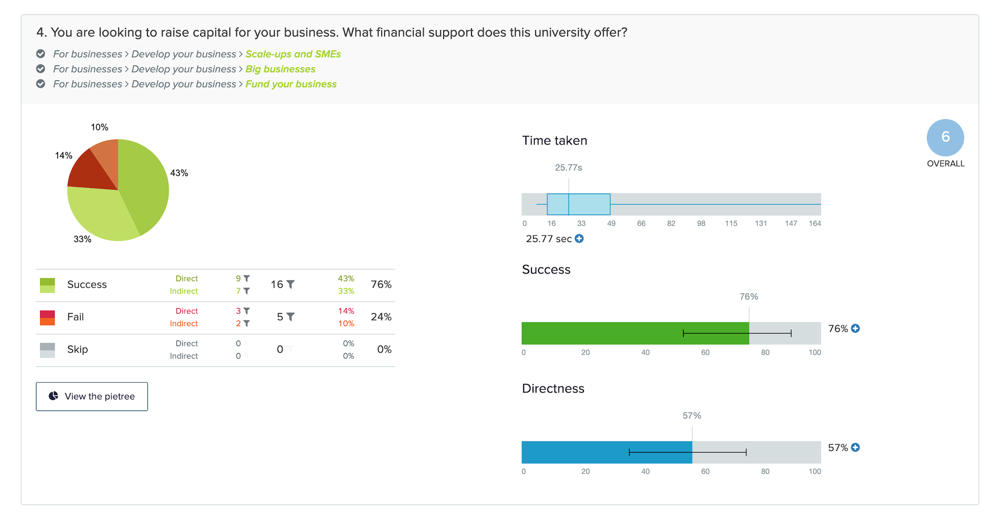
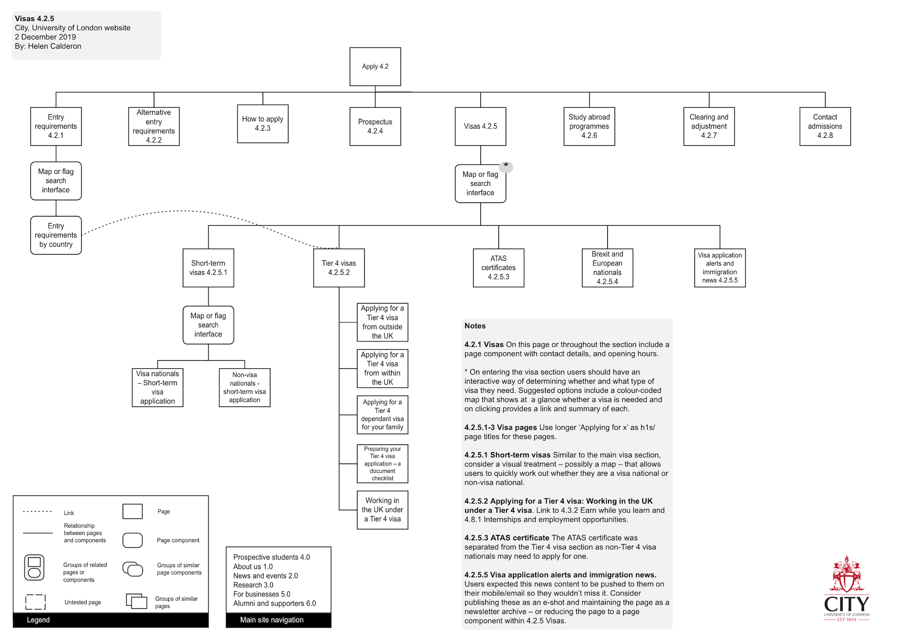
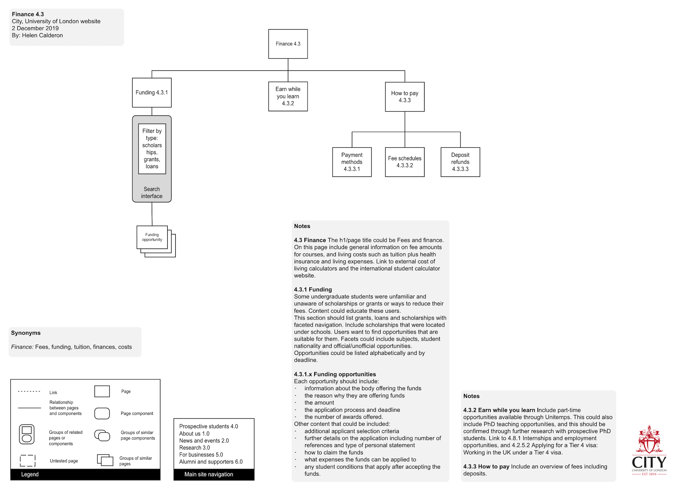
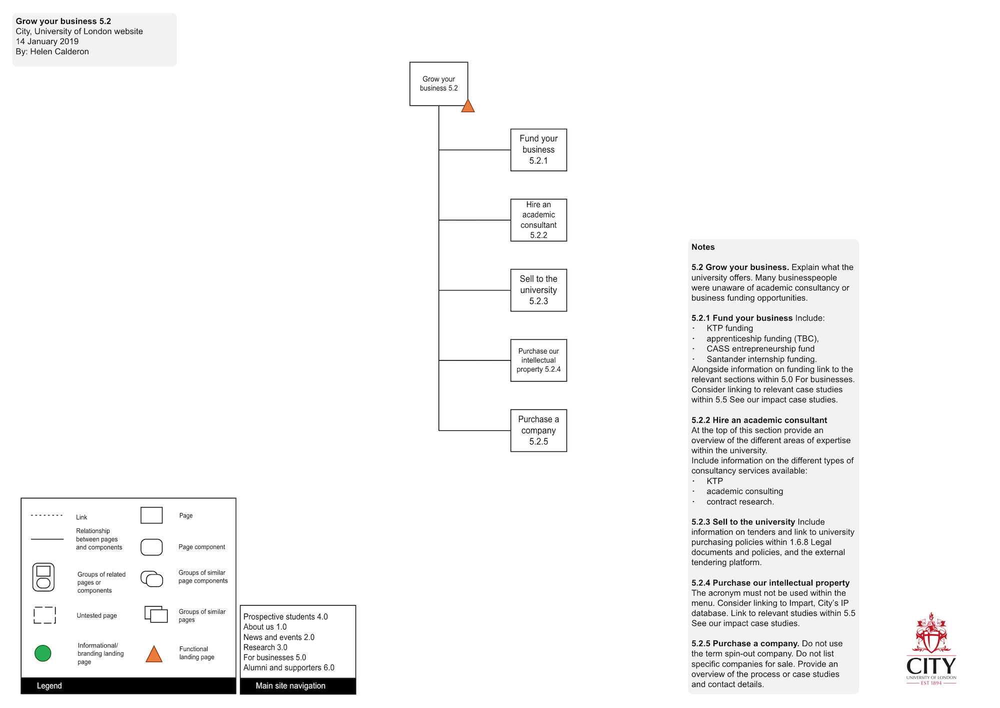

# Information architecture redesign #  

{::options parse_block_html="true" /}

##### Skills #####
* Content audit
* Interviews
* Focus groups
* Card sorting
* Moderation and facilitation
* Tree tests 
* Data analysis
* Stakeholder management
* Active listening
* Verbal and written communication
* Teamwork

##### Tools #####
* Google Analytics
* Siteimprove
* PageFreezer
* Excel
* Optimal Workshop
* Camtasia
* Video cameras
* UserTesting.com
* Visio
* Omnigraffle

{: .hero}

## Overview ## 

City, University of London is a public institution, with a global audience of 350,000+ users per month. However, its main  website [www.city.ac.uk](https://www.city.ac.uk) had not been re-developed over 10 years. With hundreds of CMS users and limited oversight it had mushroomed to 20,000 pages with no clear architecture. 

## Challenge ##

City's information-rich site needed to answer users' questions, and help them make decisions. With thousands of disparate pages and a lack of structure, users couldn't find the information they sought. The website fell short of supporting the university's key business goals, such as attracting new students and promoting its research. 

## My role ##

I worked within an agile team as the sole information architect. Over more than a year I designed and conducted a programme of user research in order to provide the university with a new and proven information architecture. Throughout the process I communicated my work and proposed architecture, getting buy-in from competing internal stakeholders.

## Approach ##

### Content audit and stakeholder interviews ###

To gain an understanding of existing online content and user behaviour across City's website I began by reviewing City's existing content, Google Analytics, Site Improve and third party SEO and market research. 

I discovered:
{: .list}
* City's existing structure was quite deep impairing findability
* Thousands of pages had little content and almost no traffic, and some high-traffic pages suffered from high bounce rates
* Most website sections did not appear in the site's primary navigation, meaning users could only find them via search 
* The most popular pages were those used by students and staff, neither of whom were the site’s intended audiences.

Alongside this I also met with stakeholders to understand their content, hear their perspective on users and their tasks, and to consider what they wanted to achieve via the website.

### User research ###

#### Card sorts and interviews ####

Following the content audit and stakeholder interviews I conducted 40+ open card sort exercises and interviews. Participants included UK and international students, undergraduate and PhD students, researchers, business people and members of the public.

I selected a sample of pages from across the website and asked participants to sort these into groups and label them. Participants flagged pages they didn’t understand and identified audiences and missing content. The card sorts gave me a written artefact of users' mental models of City's content &ndash; the language they used to describe City's content and how they expected City’s content to be organised.

Alongside card sorts, user interviews gave me insight into their online activities and information needs. 

I was restricted to 80 cards for moderated studies, so I ran 5 online studies to understand how more pages across the site might be organised. This had the added benefit of  reducing any bias that students and staff had due to their familiarity with City’s current website. 

I reviewed interview data, using sticky notes and affinity diagrams to find common goals, frustrations and information tasks and created personas to help generate empathy for users. 

#### Tree testing and interviews ####

Using the labels and groupings generated from the card sorts, together with the personas, I created an initial sitemap or 'tree'. I evaluated the architecture using tree testing studies within Optimal Workshop. Many of these studies were conducted online, with participants recruited via Usertesting.com.

 
I conducted tree tests iteratively. Using previous study results I tested different labels and structures until research showed participants could find key information. All together I conducted 20+ tree testing studies online, 20 in-person tests and guerrilla tests.

### Communicating the new information architecture ###

I communicated my research and proposed structure through regular meetings with developers and content editors and presentations to the project’s advisory board and executive team. I carried out new user studies to answer stakeholder questions and test alternative structures and labels. This process ensured the new structure balanced stakeholder requirements with users' needs, and fostered stakeholder buy-in during the project.

### Outcome ###

After a year of user research, City has a new agreed information architecture for its forthcoming website. This proven structure is backed by findings from over 25 studies with 900+ participants. Users will now be able to find the information they seek, aligning with key business goals like increasing student applications and promoting research. Regular consultation with colleagues at all levels of the organisation means stakeholders are on board.

The architecture has been used to built the forthcoming website and this will now be tested further during user testing. The new website is due to launch later this year.

