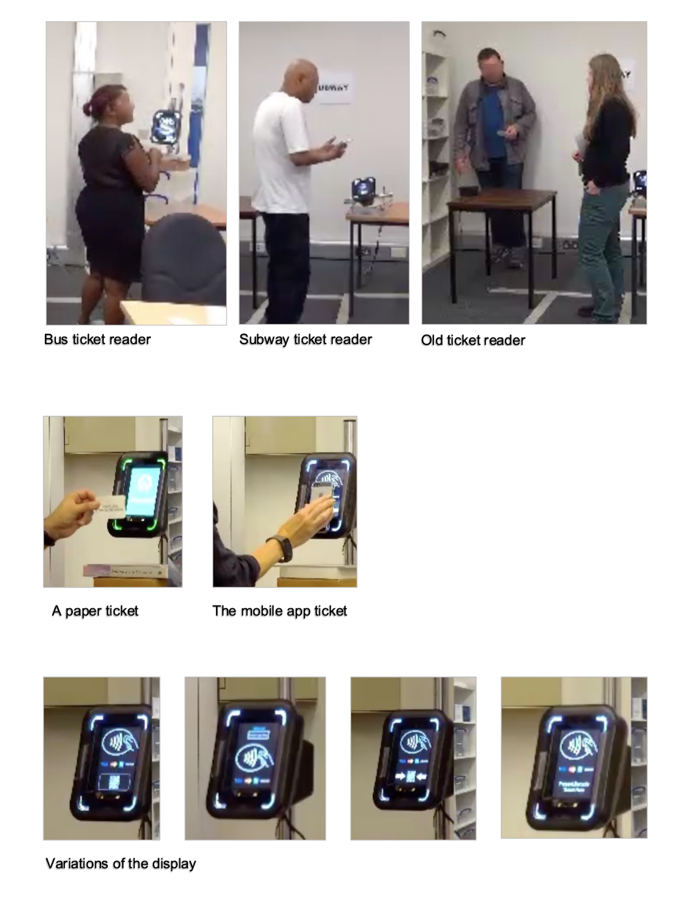
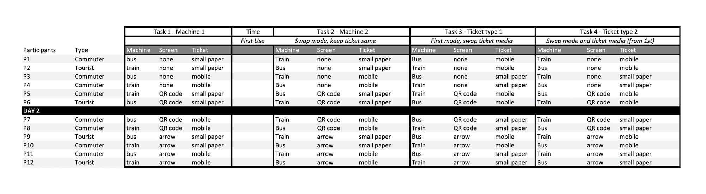
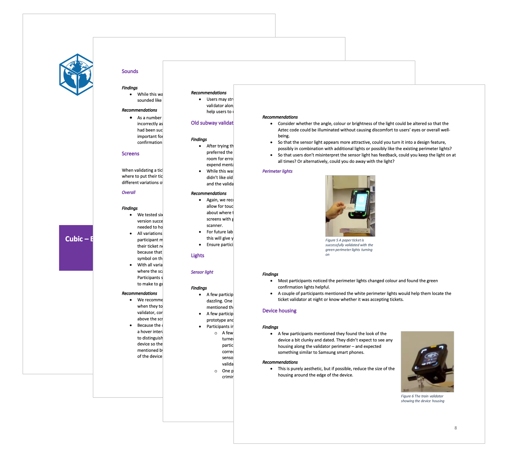

# User testing a public transport ticket reader #

Client: Cubic

{: .hero}

## Overview ##

New York City’s transport system operates using a system of plastic cards that passengers load with funds and then swipe through ticket barriers. Rolled out in 1993, the transit authority wanted to bring their ticket readers up to date so machines accepted new payment methods such as contactless.

## Challenge ##

Our client Cubic was designing a machine that would recognise and accept more and different payments. These included contactless, digital tickets within a mobile app and machine-printed paper tickets containing QR codes. 

To prevent congestion during peak times, 30 passengers needed to be able to pass through the gates every minute. Prior user testing had found that users took _up to a minute_ to validate their ticket and pass through the barriers. 

Participants didn't understand where the scanning functionality was located within the device and where to best place their ticket. To avoid a re-design of the physical device and possible delay to the  roll-out of the new machines, the client wanted to understand whether changes to the reader display could fix the problem. 

## My role ##

I worked as UX Consultant within City’s Interaction Lab, a commercial UX consultancy operating within City’s Centre for Human-Computer Interaction Design. I met with the client to learn more about the ticket barriers and understand their expectations for the study. I then designed the study, and created all test materials. I managed a student consultant, and together we ran the study. I then reviewed session notes and participant timings, and produced a detailed report for the client.
 
## Approach ##

### Preparation ###

The study involved multiple variables and scenarios: 
{: .list}
* three devices &ndash; a bus, new subway validator and an old subway validator
* three types of tickets &ndash; two paper and one mobile app
* four display screen variations

A mix of commuter and visitor participants were recruited via an external agency. 

I created a script that drew on different scenarios so that different combinations of ticket machines, tickets and displays were tested. I varied task order from session to session to reduce the impact of system learnability and participant bias. We used a spreadsheet to keep track of the variable order and combinations for each task and participant session. 

We piloted the study in the client’s office. We noticed we needed a definitive way of measuring time on task, so during testing we marked the lab floor with masking tape. After I gave the participant the first task the student consultant started the timer. Once the participant  passed through the ticket barrier and walked into the taped zone, we stopped the timer.

### Study ###

Within the usability lab we set up the three different ticket validators, one each for the bus, subway and existing subway machine. So we didn't miss participants' initial impressions we started with ticketing machines covered with cardboard boxes. Two cameras captured participants' reactions and interactions as they used the machines. 

The first day's tests gave some results that allowed the client to iterate the device display further. Day two tested two further versions of the QR-code screen.  

 
### Findings and recommendations ###

After finishing the testing I reviewed the session notes together with the student consultant and agreed on the main findings. 

Of all the different screens tested, participants were more likely to validate their ticket with one displaying a QR-code in the lower half of the device. Even with the best performing variation of the display, participants struggled to learn where exactly they needed to position their ticket (at least 3-4cm from the bottom edge of the display) in order to pass through the barriers. Many couldn’t do this within two seconds, especially on their first attempt.

As the changes to the ticket reader display did not have the desired effect, I suggested the client undertake one of the following options: 
{: .list}

1.	If time permits, update the physical device. Recess and inset the scanner so users can successfully validate their ticket by placing it directly on the screen. The tactile feedback would provide users with certainty and confidence, and would make learning where to place the ticket easy. 
2.	If time doesn’t allow, change the display to increase the likelihood users positioning their ticket within the scanner’s range. Changes could include: 
   * Dividing the contactless and barcode sections of the screen (as one requires a tap and once doesn't) 
   * Using animation to communicate how and where to best scan a ticket 
   * Adding decals to the device housing to direct users towards the scanner.
   
My written report provided additional detailed findings and recommendations for the ticket machine as a whole. While there weren’t enough participants to produce statistically representative results, I also provided time on task by participant and task success rates.

## Outcome ##
The New York Transit Authority rolled out the first ticket readers in 2019, starting with machines that accepted contactless, Apple Pay and Google Pay. Further payment methods including the mobile app and paper QR tickets remain in development, due to be released in 2022. The client has since returned to the lab to conduct further user research into possible future ticket readers. 

{: .hero}

