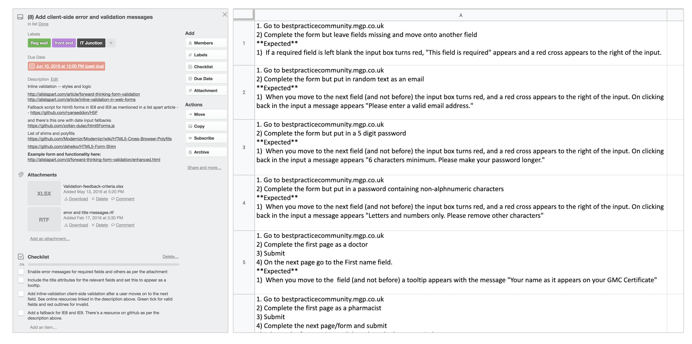

# Registration process redesign #

Client: MGP 

{: .hero}

## Overview ##

MGP publishes medical guidance for nurses and GPs. Visits to its websites and apps had jumped but users weren't registering and those that started the sign up process didn't finish it. The company wanted users to register so it could email them, and sell e-newsletters and advertising to its pharmaceutical clients. 

## My role ##

I worked within an agile team as Product Manager. Over four months I scoped the initial project, gathered stakeholder requirements, wrote user stories and acceptance criteria and managed fortnightly builds and user acceptance testing (UAT) until the new registration flow was released across three sites and an app. So I could measure the performance of the new registration process I added more detailed analytics tracking and I coded these myself.

## Approach ##

### Stakeholder requirements ###

I brought together stakeholders from sales, marketing and development to review the existing registration flow which was a lengthy seven steps. We grouped fields into mandatory, nice to have, and not needed. To reduce the burden on users and increase our conversion rate I persuaded stakeholders to break up the sign up process into two stages &ndash; first a concise registration process followed by a second request for additional information. 

### Backend requirements ###

Next I mapped out the logic and form fields for the pages within the registration process, the log in page and a log in prompt on article pages. 

I shared my documents with developers and we generated the database requirements for the redesign.

### Front end specifications ###

Next I wrote the user stories, requirements and user acceptance criteria. This included low-fidelity wireframes which I passed to the visual designer to mock up in further detail for the developers. 

### Creating the release plan ###

Working with developers we reviewed front and back end requirements and sized the user stories. I used the developers' past velocity to estimate how much work could be done in each sprint.
 
### Build ###

The developers started updating the websites but we encountered a problem in the first sprint. The registration process involved eight forms and these were duplicated across three websites. JavaScript and CSS was inlined within each PHP template, and this meant the work was taking _a lot_ longer than planned. I met with developers and together we proposed moving the registration forms to a new website. We were able to get this approved by the management team, allowing us to deliver the improved registration process to schedule. 

During the build phase I ran two-week sprints. Developers released the code onto site and I organised regular UAT sessions with colleagues.

After two months we released the new sign-up process on one site.  We didn't carry out user testing or have a beta website, so I relied on the customer feedback we received through our tech support. From this we were able to identify two defects that were preventing users from registering. Following these bug fixes we released the new registration process on the other two websites without further issues.  

# Outcome #

The number of people registering on the website increased by 300%. To compensate for the lack of user testing I added extensive tracking to the website. This allowed me to see where users were struggling. We refined the registration process further and the number of users registering jumped another 300%. This increase in sign ups helped the publisher understand who was using their sites and they were able to sell more e-newsletters and advertising to their pharmaceutical clients.

